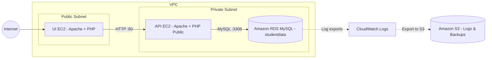

# Student Grade Uploader and Checker
## Overview
This project deploys a student grade checker and administrator management web application entirely in the AWS cloud.
The system uses a three-tier architecture:
- UI EC2 instance — serves the front-end web interface (student & admin login).
- API EC2 instance — handles data operations and connects to the database.
- Amazon RDS (MySQL) — stores student, administrator, and grade data.
- Amazon S3 Bucket — holds RDS logs and database backups.

# Architecure 

## Deployment Order 
*Required:*
- AWS Account (This was created in the learner lab enviroment)
- Key Pair saved (will need to create your own and save it somewhere safe)
- Access to repo
- Create a VPC that will have 3 Security Groups within it
- One for each of the ui,api, and db with appropriate inbound and outbound rules (the above diagram can give context) and relevant images for inbound rules have been attached in the repo [docs](https://github.com/cash-cam/COSC349-A2/tree/main/docs)

1. Create RDS Instance 
	- RDS Instance MySQL 8.0 (note the name you use for the instance I used 'studentdata')
2. Launch API EC2
	- Type t3.micro (ubuntu)
	- 
	- Subnet: Private
	- Attach API security group
	- Paste contents of *infra/api-userdata.sh* into User data field
		- changes needed: The RDS endpoint, DB_name, DB_pass, and repo_https
	- Wait for bootstrapping to complete then note API private DNS

3. 
	- Type t3.micro (ubuntu)
	- Subnet: public
	- Attach UI security group
	- 
	- Paste contents of *infra/ui-userdata.sh* into User data field.
			- changes needed: API_BASE_URL to API EC2 PRIVATE IP
	- Wait for bootstrap to compete.

## Accessing System.
- To access the UI EC2 via SSH (this will need to be a inboundrule in the UI security group) `SSH -i <KEY-PAIR> ubuntu@<public-ip-address>`
- Access to the API EC2 is via the SSH of the UI EC2 `SSH -i <KEY-PAIR> ubuntu@<private-ip-address>`
- To access the MySQL database the user will need to be connected the the API EC2 and then use something such as the following comamnd: `mysql -h <endpoint> -u <username> -p -e "
  USE studentdata;
  SELECT * FROM enrolments WHERE student_id='S0000003' AND paper_code='BSNS114';
  " `

